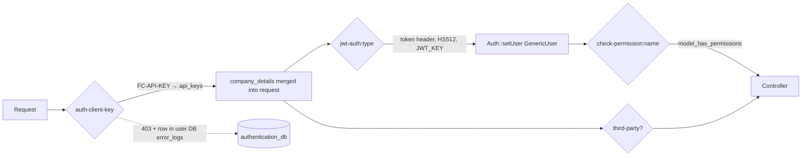

# finchglow/authenticator — How It Works and Audit

The shared Composer package that authenticates requests in user, product, payment and booking services. This doc explains what each middleware does, what it depends on, and how releases work, and records an audit done on 2026-10-08.

**Who this is for:** engineers taking over the package. Read §1–§6 to understand it and §7 for what needs fixing.

> **Status:** most findings are fixed on branch `audit-remediation` in every repo (not committed yet). §9 lists what is fixed, what is deferred, the release order and the Doppler prerequisites. Sections §1–§7 describe the code **as audited (v3.5)**.

Every behaviour below was read from the source at `v3.5` (`81ea2c9`). Items marked **verified** were also reproduced against the local stack. Route counts come from `php artisan route:list` in each service on the same date.

---

## 1. At a Glance

- **What it is.** A Laravel package of eight route middleware plus two small services. It has no models, no migrations and no tests.
- **Who issues credentials.** User-service is the source of truth: it issues the JWTs, creates the API keys, and owns every table the package reads.
- **How it gets data.** The package reads user-service's database directly, through a connection called `authentication_db` that each service must define.
- **The shared secret.** A single env var, `JWT_KEY`, verifies every JWT (HS512) **and** decrypts every stored API key and HMAC secret (CipherSweet).

| Service | Constraint | Used how often | Notes |
|---|---|---|---|
| travels-user-service | `^3.5` | `jwt-auth` ×93, `auth-client-key` ×49, `permission:` ×41 | Registers the package's `CheckPermissionMiddleware` under its own alias `permission` (`app/Http/Kernel.php:73`) |
| travels-product-service | `^3.5` | `jwt-auth` ×150, `auth-client-key` ×92, `get-user` ×62, `check-permission` ×38, `third-party` ×4 | |
| travels-payment-service | `^3.5` | `jwt-auth` ×46, `auth-client-key` ×42, `get-user` ×2 | |
| travels-booking-service | `^3.5` | `jwt-auth` ×33, `auth-client-key` ×12, `get-user` ×7 | |
| travels-util-service | not installed | — | |

The three hardening middlewares (`third-party-ip-allowlist`, `third-party-signature`, `third-party-throttle`) are not used on any route in any service.

---

## 2. Request Flow



The usual stacks:

| Caller | Middleware | Headers |
|---|---|---|
| Super admin, company admin | `jwt-auth:super_admin` or `jwt-auth:company` (+ `check-permission:…`) | `token` |
| Agent | `auth-client-key:company` (in user-service) or `auth-client-key` (elsewhere), then `jwt-auth:agent` | `FC-API-KEY` (company key) + `token` |
| Customer | `auth-client-key:agency` + `jwt-auth:user` | `FC-API-KEY` (agency key) + `token` |
| Third-party partner | `auth-client-key:agency` + `third-party` | `FC-API-KEY` (agency key) |
| Service-to-service | `auth-client-key` | `FC-API-KEY` forwarded from the original caller |

---

## 3. The Middleware, One by One

Aliases are registered in `src/AuthenticatorServiceProvider.php:32-39`.

### 3.1 `auth-client-key[:company|agency]` — `AuthenticateClientMiddleware`

1. **Read the header.** It reads `FC-API-KEY`. If the header is missing it returns 403 (checkpoint `missing_api_key_header`).
2. **Live or test.** If the key contains `live` **anywhere**, it is treated as a live key (`:30`).
   - A live key is rejected unless `APP_ENV` is a live environment (`env_mismatch`).
   - In v3.5 "live" means exactly `prod`. Open PR #1 widens this to `AUTHENTICATOR_LIVE_ENVIRONMENTS`, default `prod,production,live`.
3. **Look up the key.** It takes the text after the first `_`, sha256-hashes it, and looks for that hash in `api_keys.test_hash_api_key` or `live_hash_api_key` (`api_key_not_found`).
4. **Load the owner.** It re-queries with joins to `agencies`, `companies` and `branches` (twice), and fails with `keyable_not_found` if nothing comes back.
5. **Check the type.** If the middleware has an argument, it must equal `api_keys.type` (`client_type_mismatch`).
6. **Confirm the key.** It CipherSweet-decrypts the stored copy and compares it with the raw key (`key_decryption_mismatch`).
7. **Pass details on.** It merges `company_details` into the **request input** (`:122`). For agency keys:
   - `name`, `branch_id` and `branch_name` hold the agency's values;
   - `id` holds the keyable id (the agency id or the company id).

   Other fields: `agency_id`, `company_id`, `agency_type`, `owner_id`, `company_email`, `company_name`, `company_type`, `user_type`.
8. **Unexpected errors.** Any other exception is logged as `unexpected_exception` with its trace, and the request gets 500 `Invalid Authentication`.

**Not checked:**

- `api_keys.deleted_at`
- `agencies.status` and `agencies.deleted_at`
- `companies.status`

### 3.2 `jwt-auth:{type}` — `JwtAuthMiddleware`

1. **Read the token.** It reads the JWT from the **`token`** header; the `Authorization` read is commented out (`:15-20`). A `Bearer ` prefix is stripped.
2. **Verify.** It verifies the token as HS512 using `env('JWT_KEY')`, including `exp` and `nbf`, then reads the `data` claim.
3. **Check the company binding.** For types other than `super_admin` and `company`, `company_details` must exist (so `auth-client-key` must run first):
   - `agent`: the token's `company_id` must equal `company_details.id`;
   - `user`: the token's `company_id` and `agency_id` must equal `company_details.company_id` and `company_details.agency_id`.
4. **Check the type.** The token's `type` must equal the argument.
5. **Set the user.** It merges `user` into the request and calls `Auth::setUser(new GenericUser(...))`.
6. **Failures** return JSON `{"status":false,"error":"<exception message>"}` with 401. **Verified:** the error text is the raw library message, e.g. `Signature verification failed` or `Syntax error, malformed JSON`.

### 3.3 `check-permission:{name}` — `CheckPermissionMiddleware`

1. **Decode the token** from the `token` header. This happens outside any try/catch, so a bad token here gives 500, not 401.
2. **Owners skip the check.** If the token's `role == "owner"`, the request is allowed with no further check. That covers company owners, agency owners, and super admins whose role is owner.
3. **Pick the model type.** `super_admin` and `company` map to `App\Models\Admin`; `agent` maps to `App\Models\Agent`; anything else maps to `App\Models\User`.
4. **Look up the permission.** It reads `model_has_permissions` (or `env('PERMISSIONS_TABLE')`) joined to `permissions` for that model, and requires the permission name. A missing permission returns **401**.
5. **Not used:**
   - permissions granted through **roles** (`role_has_permissions`);
   - `guard_name`.

### 3.4 `get-user` — `GetUserMiddleware`

Optional authentication. If a `token` header decodes, it sets the Auth user; any error is silently ignored. A route that has only `get-user` is public.

### 3.5 `third-party` — `IsThirdPartyMiddleware`

Requires `company_details.agency_type === 'third_party'`. Otherwise it returns 403 (`missing_company_details` or `not_third_party_agency`).

### 3.6 Third-party hardening (not used on any route)

All three read `third_party_security_settings` for the agency through `ThirdPartySecuritySettingsService::getForAgency`. Each middleware queries it separately and nothing is cached. With no settings row, the feature is off for that agency.

| Alias | What it does | Switch |
|---|---|---|
| `third-party-ip-allowlist` | When `enforce_ip_allowlist` is on and the list isn't empty, `$request->ip()` must exactly match one of `allowed_ips` (`ip_not_allowlisted`) | `THIRD_PARTY_IP_ALLOWLIST_MIDDLEWARE_ENABLED` |
| `third-party-signature` | When `enforce_signature` is on and an `hmac_secret` exists: `X-FC-Timestamp` must be within ±300s and `X-FC-Signature` must equal `hex(hmac_sha256(METHOD\npath\nbody\ntimestamp))`, compared with `hash_equals`; a signature is rejected if it was seen in the last 300s | per agency only |
| `third-party-throttle` | Laravel `RateLimiter`, key `third-party:{agency_id or ip}`, limit `rate_limit_per_minute` or `DEFAULT_THIRD_PARTY_RATE_LIMIT` (60); returns 429 with `Retry-After`; not logged | `THIRD_PARTY_RATE_LIMIT_MIDDLEWARE_ENABLED` |

### 3.7 Failure logging — `Concerns/LogsAuthorizationFailures`

`auth-client-key`, `third-party`, the IP allowlist and the signature check write a row to `authentication_db.error_logs` **synchronously, before aborting**:

- `service=authenticator`, `type=authorization`, `file=<class>`;
- `error` = `{checkpoint, message, trace?}`.

`jwt-auth`, `check-permission`, `get-user` and the throttle do not log.

---

## 4. Data, Config and Secrets

### 4.1 Tables read through `authentication_db` (all owned by user-service)

| Table | Read by | Notes |
|---|---|---|
| `api_keys` | `auth-client-key` | `keyable_type` must be the literal `App\Models\Agency` or `App\Models\Company` |
| `agencies`, `companies`, `branches` | `auth-client-key` | Branch join has no HQ filter (§7, M4) |
| `model_has_permissions`, `permissions` | `check-permission` | |
| `third_party_security_settings` | hardening middleware | Table name configurable, but the CipherSweet field id uses it too — see the note under §4.3 |
| `error_logs` | failure logging | **Written**, not just read |

Each service therefore needs a database user on user-service's database **with INSERT rights** (because of `error_logs`). Renaming a column in any of these tables breaks authentication in every service at once.

### 4.2 Config (`src/config/authenticator.php`, merged automatically)

| Key / env | Default | Used? |
|---|---|---|
| `APP_ENV` → `app_env` | `dev` | Yes: live-key check |
| `AUTHENTICATOR_LIVE_ENVIRONMENTS` | `prod,production,live` | Only on the unreleased fix branch; v3.5 checks `=== 'prod'` |
| `THIRD_PARTY_*`, `DEFAULT_THIRD_PARTY_RATE_LIMIT` | see §3.6 | Yes |
| `JWT_KEY` → `jwt_key` | `secret` | **No.** The code calls `env('JWT_KEY')` directly |
| `PERMISSIONS_TABLE` → `permissions_table` | `model_has_permissions` | **No.** The code calls `env()` directly |
| `API_KEY_TABLE`, `API_KEY_COLUMN`, `API_SECRET_COLUMN` | `users` / `api_key` / `api_secret` | **No.** Table and column names are hard-coded |

### 4.3 Secrets

`JWT_KEY` must be exactly **64 hex characters**. CipherSweet uses it as a 256-bit key, and php-jwt v7 needs at least 512 bits for HS512; 64 characters used as a raw string meets that. The same value must be set in user, product, payment and booking.

**Note on the security-settings table name:** user-service encrypts `hmac_secret` with the CipherSweet field id `('third_party_security_settings', 'hmac_secret')` (`AuthService.php:411`). If `THIRD_PARTY_SECURITY_TABLE` is changed, decryption fails.

### 4.4 Tokens (issued by user-service `App\Http\Services\Auth\JwtAuthService`)

- **Algorithm and lifetime:** HS512, 60 minutes, sent back in the response body as `data.token`.
- **Claims:**
  - top level: `iat`, `nbf`, `exp`, `jti`, `iss = "your.server.name"`; there is no `aud`;
  - `data`: `id`, `email`, `name`, `company_id`, `agency_id`, `agency_name`, `branch_id`, `role`, `type`, `company.company_name`, `branch.{branch_name, contact_phone, contact_email, address}`.
- **Token types issued:** `super_admin`, `company`, `agent`, `user`. **`admin` is never issued.**
- **Revocation:** none. Logging out or deactivating a user doesn't invalidate a token until it expires.

### 4.5 API keys (created by user-service `AuthService::generateApiKeys`)

| | |
|---|---|
| Format | `test_` + 24 alphanumerics, `live_` + 32 alphanumerics |
| Storage | sha256 hash plus a CipherSweet copy (FIPSCrypto) |
| Owner | one row per company or agency (morphOne) |
| Created | only when a company or agency account is set up |
| Rotation, revocation, regeneration | **no endpoint or command** |

---

## 5. Releases and Versions

**How a change ships:**

1. Change the package.
2. Tag it, e.g. `v3.6`.
3. Run `composer update finchglow/authenticator` in **each** service and commit the `composer.lock`.

All four services pin `^3.5`, so a new minor tag is picked up on the next update.

**State on 2026-10-08:**

- **`master` is stale.** It is at `e7749a5` (2025-12-22). Every tag from **v2.8 to v3.5 was cut from commits that are not on `master`.**
- **The only branch carrying v3.5 is `fix/live-key-environments`.** PR #1 (open, mergeable, 12 commits) contains Damilola's untagged-on-master history plus the multi-environment live-key fix. Merging it brings `master` in line with what is deployed.
- **Local `vendor/` had drifted.** User-service had no package installed; product and payment had v3.1; booking had v2.9. Every lock file pins v3.5. A `composer install` fixed this; the lock files themselves were right.
- **There is no CI, no test suite and no changelog.** `composer.json` declares no `php` or `illuminate/*` constraint.

---

## 6. Running and Testing It Locally

See `travels-product-service/docs/THIRD_PARTY_API.md` §6–§7 for ports, start script and test credentials. Quick checks against the local stack:

```bash
# client key: 403 without header, 403 for a company key on the partner API, 200 for the agency key
curl -s -o /dev/null -w '%{http_code}\n' -X POST localhost:9001/api/third-party/flights/search -H 'Accept: application/json'
curl -s -o /dev/null -w '%{http_code}\n' -X POST localhost:9001/api/third-party/flights/search -H 'Accept: application/json' -H 'FC-API-KEY: test_PGlEcDe6odaPWHq1zXw6ZtsK'

# live key outside prod → 403, checkpoint env_mismatch in ft_user_service.error_logs
curl -s -X POST localhost:9001/api/third-party/flights/search -H 'Accept: application/json' -H 'FC-API-KEY: live_abcdefghijklmnopqrstuvwxyz123456'

# JWT: tampered token → 401 {"status":false,"error":"Signature verification failed"}
curl -s localhost:9001/ps/api/v1/company/margin/commercial-rules -H 'Accept: application/json' -H 'token: <company JWT with last char changed>'
```

**Where rejections are logged:** `select * from ft_user_service.error_logs where service='authenticator' order by id desc;`

---

## 7. Audit Findings

Severity is about impact if exploited or triggered. The **Where** column points at `v3.5` unless it names a service.

### Critical

| # | Finding | Where | Impact | Fix |
|---|---|---|---|---|
| C1 | **A database host, user and password are committed.** It is the RDS endpoint for the `authentication_db` (user) database. The same values appear as `env()` defaults in payment and product, and have been in git history since 2024-10-31 (`050c71e`). | `README.md:29-33`; payment `config/database.php:98-102`; product `config/database.php:94-98` | Anyone with read access to any of three repos, now or in the past, can connect to the auth database. | Rotate the password now. Remove the defaults (use `''`). Restrict network access to the RDS instance. Consider purging the history. |
| C2 | **API keys are readable without login.** `GET /us/api/v1/admin/errors` sits outside every auth group and returns `error_logs`. Several failure paths write plaintext keys into that table: `RegisterApiGatewayClientJob` logs its full request, including the partner's `test_` key and, in prod, the `live_` key (`ApiGatewayService.php:93-101`); `CreateWalletJob` logs the company `FC-API-KEY` (`CreateWalletJob.php:47`, payload built at `AgentService.php:495-505`). **Verified locally:** the endpoint returned the third-party agency's key from the gateway-registration failure. | user-service `routes/admin.php:24-26` | Anyone can collect partner and company API keys, plus traces and partner emails and IPs. | Put the route under `jwt-auth:super_admin` today. Stop logging keys and request payloads. Treat every key that may have reached `error_logs` in staging or prod as exposed and rotate it (this needs the rotation feature from H2). |

### High

| # | Finding | Where | Impact | Fix |
|---|---|---|---|---|
| H1 | **One symmetric secret does everything.** `JWT_KEY` signs and verifies every JWT (HS512) and is also the CipherSweet key for every API key and HMAC secret. | `JwtAuthService.php:13`; `CipherSweetEncryption.php:25` | Leaking `.env`/Doppler from any one service lets an attacker mint `super_admin` tokens and decrypt every stored API key. | Use asymmetric signing (RS256/EdDSA): user-service holds the private key, other services hold the public key. Use a separate encryption key that only user-service holds. |
| H2 | **No revocation, and status is ignored.** `auth-client-key` ignores soft-deleted keys and agency or company status. There is no way to rotate or revoke a key. JWTs stay valid for 60 minutes after a user is deactivated or logs out. | `AuthenticateClientMiddleware.php:47-90` | A deactivated or deleted agency, including a third-party partner, keeps API access indefinitely. | Filter on `deleted_at IS NULL` and `status='active'` in the join. Add key rotation and revocation in user-service. Add a `jti` denylist or shorter tokens with refresh. |
| H3 | **`company_details` lives in request input.** `$request->merge(...)` puts it where a client could also supply it in the body or query string. `jwt-auth` (agent and user binding) and app helpers such as `get_company()` (product, booking, user) trust it. | `AuthenticateClientMiddleware.php:122`; `JwtAuthMiddleware.php:28` | Not exploitable today: every `jwt-auth:agent` and `jwt-auth:user` route also has `auth-client-key`, which overwrites the value (checked with route lists). Any future route that drops the client key lets callers spoof their company or agency. | Store it in `$request->attributes`, not input. Read it from there in the helpers. |
| H4 | **Every rejection writes to the shared auth database, synchronously.** That includes requests with no header at all. **Verified:** 3 keyless requests produced 3 new `error_logs` rows. If the insert fails, a 403 turns into a 500. | `Concerns/LogsAuthorizationFailures.php:33` | Anyone can drive unauthenticated write load and table growth on the database every service depends on. | Log to the app log or Sentry instead, or sample, or rate-limit per IP. Don't insert for `missing_api_key_header`. |
| H5 | **Every service is coupled to user-service's schema and credentials.** Seven user-service tables are read directly, and `error_logs` is written. | §4.1 | A schema change in user-service can break auth everywhere. Each service holds write-capable credentials to the identity database. | Short term: a read-only DB user plus a separate log sink. Longer term: a token/key introspection endpoint in user-service with caching. |

### Medium

| # | Finding | Where | Impact | Fix |
|---|---|---|---|---|
| M1 | **`env()` is read at runtime**, so `php artisan config:cache` breaks auth everywhere. With `JWT_KEY` null, the `'secret'` fallback is too short for php-jwt v7 and every token is rejected; CipherSweet throws and every API key returns 500. The old `Dockerfile.bkup` files ran `config:cache`; the current `run.sh` does not. | `JwtAuthService.php:13`; `CipherSweetEncryption.php:25`; `CheckPermissionMiddleware.php:43` | A routine optimisation step causes a full outage. | Read `config('authenticator.jwt_key')` everywhere. Remove the `'secret'` default. |
| M2 | **Live/test detection uses a substring match.** `str_contains($apiKey,'live')` checks anywhere in the key, and the prefix itself is never validated. A malformed key with no `_` hashes `null` and still queries the database. | `AuthenticateClientMiddleware.php:30,44` | A test key whose random part contains "live" is rejected (about 1 in 700k keys). Garbage input reaches the database. | Parse strictly with `^(test|live)_([A-Za-z0-9]+)$`. |
| M3 | **The permission model is incomplete.** Only direct permissions count; roles and `guard_name` are ignored. `role=owner` bypasses every check. Denials return 401 instead of 403. An invalid token here gives 500. | `CheckPermissionMiddleware.php:33-61` | Permissions granted through Spatie roles never work. Owner tokens can pass any permission, but only on routes whose `jwt-auth:<type>` already allowed them (checked: no route uses `check-permission` without `jwt-auth`). | Include `role_has_permissions` and the guard. Return 403. Wrap decoding in a try/catch. |
| M4 | **The branch is picked arbitrarily.** The `branches` join has no HQ filter or ordering. | `AuthenticateClientMiddleware.php:69-70` | When an agency or company has several branches, `company_details.branch_id` is whichever row MySQL returns first, so bookings and invoices can land on the wrong branch. | Join only the HQ or default branch, or add an `orderBy`. |
| M5 | **Hardening has gaps once it's switched on.** The IP check is exact-match (no CIDR) and uses `$request->ip()`, while product's `TrustProxies` trusts no proxies. Replay protection and the throttle use the default cache store (file, per instance). The replay check is `has()` then `put()`, which isn't atomic. Settings are queried three times per request. | `EnforceThirdPartyIpAllowlist.php:35`, `VerifyThirdPartySignature.php:55-62`, `ThrottleThirdParty.php` | Turned on behind a load balancer, every partner gets 403. Limits and replay protection are per container, not global. | Configure trusted proxies. Support CIDR. Use a shared Redis store with `Cache::add`. Cache the settings for the request. |
| M6 | **`jwt-auth:admin` routes can't be reached**, because no `admin` token type exists. Affected: product `GET /ps/api/v1/command`, payment `POST /pa/api/v1/wallet/credit-manual`, and booking `zoho/auth-url`, `bulk-sync`, `sync-booking`, `sync-status`. | the services' routes | Manual wallet credit and the Zoho admin actions can't be used. | Change these routes to `super_admin` (or add the type in user-service). |
| M7 | **A typo in a permission name.** `'permission: add company admin'` has a leading space. | user-service `routes/company.php:71` | Only owners can invite company staff; everyone else always gets 401. | Remove the space. |

### Low

| # | Finding | Where | Fix |
|---|---|---|---|
| L1 | Raw library error messages go to the client. `jwt-auth` returns JSON `{status,error}` while other middleware uses `abort()`, so error formats are inconsistent. | `JwtAuthMiddleware.php:65` | Return a generic message and log the detail |
| L2 | Operator precedence: `!== $companyDetails['id'] ?? ""` applies `??` to the boolean. A missing key raises an ErrorException, which becomes a 401 containing a PHP warning. | `JwtAuthMiddleware.php:36,42,46` | Use `($companyDetails['id'] ?? '')` |
| L3 | The JWT payload carries PII (email, branch phone, email and address). `iss` is a placeholder. There is no `aud` and no issuer/audience check. `getAuthUser()` reads `Authorization` while the middleware reads `token`. | user-service `JwtAuthService.php:27-60`; package `JwtAuthService.php:17` | Keep ids only. Set and verify `iss`/`aud`. Pick one header. |
| L4 | `GenericUser` is the authenticated user, so it has no `getMorphClass`, relations or Eloquent methods. App code that expects a model fails (payment hit this on 2026-08-26). | `JwtAuthMiddleware.php:59` | Document it, or provide a small user DTO with the needed helpers |
| L5 | Package hygiene: no tests, no CI, no `php`/`illuminate` constraints, no changelog. `master` is behind the tags. The README is outdated (shows `jwt-auth:admin`, says MIT, describes config that doesn't exist). The provider publishes the middleware into apps, which invites forks. | repo | Merge PR #1. Add PHPUnit with Orchestra Testbench and a CI workflow. Tag from `master` only. |
| L6 | Unused config keys (`jwt_key`, `api_key_*`, `permissions_table`) suggest settings that do nothing. | `src/config/authenticator.php` | Wire them in or delete them |

### What is done well

- **API keys** are high-entropy, stored only as a hash plus an encrypted copy, and split into test and live keys.
- **Live keys are blocked outside prod.**
- **Rejections** carry named checkpoints, which makes failures traceable.
- **Signatures** are compared with `hash_equals` and include a timestamp and replay check.
- **The HMAC secret** never leaves a local variable.

---

## 8. Suggested Order of Work

1. **Now:**
   - Rotate the auth database password (C1).
   - Put `/admin/errors` behind auth. Purge rows that contain `test_`/`live_` keys or `apiKey` (C2).
   - Merge PR #1 so `master` matches what is deployed.
2. **Next release (v3.6):**
   - status and soft-delete filters in `auth-client-key` (H2);
   - attributes instead of input for `company_details` (H3);
   - no DB write for missing headers (H4);
   - `config()` instead of `env()` (M1);
   - strict key parsing (M2);
   - HQ branch join (M4);
   - 403 for permission denied (M3, partial);
   - generic error messages (L1, L2).

   Add a Testbench test suite and CI with it.
3. **User-service changes:**
   - key rotation and revocation endpoints;
   - fix the `admin`-type routes (M6) and the permission typo (M7);
   - trim the JWT claims (L3).
4. **Design change:**
   - asymmetric JWT signing and a separate encryption key (H1);
   - a read-only auth DB user or an introspection endpoint (H5);
   - a shared Redis store for hardening (M5) before enabling it.

---

## 9. Remediation Status (2026-10-08)

The fixes are on branch `audit-remediation` in authenticator, user, product, payment, booking and util. Nothing is committed yet.

### Fixed in the package (to be tagged v3.6)

| Finding | Fix |
|---|---|
| H2 | Keys are rejected when `api_keys.deleted_at` is set, when the agency is soft-deleted or `inactive`, or when the company is `inactive` (checkpoint `keyable_inactive`) |
| H3 | Global `StripClientCompanyDetails` middleware removes any `company_details` a client sends |
| H4 | No DB row for a missing header. Other failures write at most one row per checkpoint, per IP, per minute. Logging failures can no longer turn a 403 into a 500. Every rejection also goes to the app log. |
| M1, L6 | All secrets are read through `config()`. The `'secret'` fallback is gone. New `encryption_key` setting, falling back to `JWT_KEY`. Unused config keys removed. |
| M2 | Keys must match `^(test\|live)_[A-Za-z0-9]+$` exactly |
| M3 (partial) | A bad token on `check-permission` returns 401, not 500. Owner bypass, direct-permission lookup and 401 on denial are unchanged by decision. |
| M4 | The branch is resolved separately: HQ first, then active, then oldest. Company keys only get company-level branches. |
| M5 | IP allowlist supports CIDR and IPv6. Replay check is atomic. Settings are read once per request. Throttle can use a shared cache store. |
| L1, L2 | `jwt-auth` returns a generic error message, and the precedence bug is fixed |
| L5 | Testbench suite (42 tests), CI on PHP 8.2/8.3, accurate README, `php`/`illuminate` constraints |
| C1 | README no longer contains database credentials |
| New | `auth-internal` middleware for service-to-service calls: a shared `X-Service-Key` (env `INTERNAL_SERVICE_KEY`), falling back to `FC-API-KEY` |

### Fixed in the services

| Finding | Fix |
|---|---|
| C1 | Product and payment `config/database.php` no longer default to the RDS credentials |
| C2 | user `GET /admin/errors` requires `jwt-auth:super_admin`. API keys are no longer written to `error_logs` or logs. |
| M6 | `jwt-auth:admin` routes are now `super_admin`: payment `credit-manual` and booking's Zoho routes. Product's `/command` route was deleted. |
| M7 | Permission typo fixed |
| Internal routes | Every internal route in product, booking and payment uses `auth-internal`. Callers forward the tenant key, else send `X-Service-Key`. |

### IP handling and webhooks (second round, same branches)

| Change | Where |
|---|---|
| `TrustProxies` reads `TRUSTED_PROXIES` (comma IPs/CIDRs, or `*`). Unset means current behaviour. Needed before any IP-based control can see the real client IP. | all five services |
| `allowed_ips` accepts exact IPs and CIDR ranges (IPv4 and IPv6), and is required only in production | user-service invite and admin security-settings update |
| Admin security-settings update now syncs `allowed_ips` and the rate limit to the API gateway client. Best effort, reported as `gateway_synced`. | user-service `ApiGatewayService::updateClient` |
| Third-party routes are limited per agency (`third-party-throttle`) instead of Laravel's shared per-IP `throttle:api` | product `routes/third_party.php` |
| Dead Paystack IP allowlists removed. Paystack, Squad and Flutterwave webhooks now verify signatures in `log` mode first (see `travels-payment-service/docs/WEBHOOK_SIGNATURES.md`). | payment |

### Not fixed — follow-up

- **Design changes, deferred by decision:**
  - H1: asymmetric JWT signing; a separate encryption key, which also needs user-service to stop using `env('JWT_KEY','secret')`.
  - H2: key rotation and revocation endpoints; a JWT `jti` denylist.
  - H5: a read-only auth DB user or an introspection endpoint.
  - M3: counting role permissions and returning 403 (needs frontend agreement).
  - L3: trimming JWT claims (frontends may read them).
- **Ops work:**
  - rotate the auth DB password (C1) and consider purging it from git history;
  - purge `error_logs` and `failed_jobs` rows that contain `test_`/`live_` keys or `apiKey`, and treat those keys as exposed (C2);
  - merge PR #1 so `master` matches the tags.

### Release order

1. **Authenticator:** merge `fix/live-key-environments` (PR #1) and `audit-remediation` into `master`, then tag **v3.6**.
2. **Doppler, every environment** (also add `TRUSTED_PROXIES` per service, `THIRD_PARTY_RATE_LIMIT_CACHE_STORE=redis` in product, `PAYMENT_WEBHOOK_SIGNATURE_MODE=log` in payment, and `API_GATEWAY_CLIENT_UPDATE_METHOD`/`_PATH` in user if the gateway's update endpoint differs from `PATCH /clients/{client_id}`):
   - `INTERNAL_SERVICE_KEY`: same value in product, payment and booking;
   - `JWT_KEY` everywhere;
   - all `AUTH_DB_*` (no defaults any more);
   - all `RABBITMQ_*` (no credential defaults);
   - the queue names in `travels-product-service/docs/MESSAGE_QUEUES.md` §3.
3. **Each service:** set `"finchglow/authenticator": "^3.6"`, run `composer update finchglow/authenticator`, and commit the lock file.
4. **Deploy booking first**, so its broker copies accept the new array `backoff`. Then deploy payment, product and user together, because the internal routes need `auth-internal` on both sides.
